# 📘 Manual Completo de Disciplinas e Artefatos do ITSM (Mermaid)

---

# 📊 Tabela Comparativa — ITSM aplicado à Engenharia de Dados

| **Disciplina ITSM** | **Objetivo** | **Principais Artefatos (DataOps/Engenharia de Dados)** |
|----------------------|--------------|---------------------------------------------------------|
| **Gerenciamento de Incidentes** | Restaurar serviços rapidamente após falha | Data Incident Report, Catálogo de Incidentes, Dashboards de Monitoramento (Airflow, Datadog, Grafana) |
| **Gerenciamento de Problemas** | Identificar causas-raiz e evitar recorrência | Data Quality Reports, Known Error Database (KEDB), Lineage Reports, Post-Mortem Reports |
| **Gerenciamento de Mudanças** | Controlar mudanças avaliando risco/impacto | Data Contracts (YAML/JSON), Pull Requests, Change Requests, CI/CD Logs, Versionamento de Schemas |
| **Gerenciamento de Liberação** | Planejar, testar e implementar releases | Deploy de Pipelines (Airflow, Dataflow), Pacotes de Transformação (dbt), Release Notes |
| **Gerenciamento de Configuração e Ativos** | Controlar ativos e relacionamentos | Data Catalog, CMDB de Dados, Glossário de Negócio, Metadados Técnicos |
| **Gerenciamento de Nível de Serviço (SLA/OLA)** | Garantir entrega conforme acordos | SLAs de Data Pipeline, OLAs de Latência, Relatórios de Conformidade de SLA |
| **Gerenciamento de Catálogo de Serviços** | Manter informações de serviços disponíveis | Catálogo de Dados, APIs de Dados, Documentação de Datasets |
| **Gerenciamento de Continuidade de Serviço (ITSCM)** | Garantir continuidade em caso de desastre | Plano de Continuidade de Datalake, DRP de BigQuery/Storage, Runbooks de Recuperação |
| **Gerenciamento de Disponibilidade** | Assegurar metas de disponibilidade | Relatórios de Disponibilidade de Pipelines, Monitoramento de SLAs, Alertas em Tempo Real |
| **Gerenciamento de Capacidade** | Garantir suporte à demanda presente e futura | Planejamento de Capacidade de Storage/BigQuery, Relatórios de Consumo, Modelos de Demanda de Dados |
| **Gerenciamento de Segurança da Informação** | Proteger confidencialidade, integridade e disponibilidade | Políticas de Data Governance, Logs de Auditoria, Registro de Incidentes de Segurança de Dados |
| **Gerenciamento de Conhecimento** | Capturar e compartilhar conhecimento | Playbooks de Incidentes, Artigos de Padrões de Modelagem (Star Schema, Data Vault), Documentação de Pipelines |
| **Gerenciamento de Requisições de Serviço** | Atender solicitações de usuários | Solicitações de Extração de Dados, Catálogo de Requisições (APIs, Queries Ad-Hoc), Tickets de Atendimento |
| **Gerenciamento Financeiro de Serviços de TI** | Controlar custos e investimentos | Relatórios de Custos por Dataset/Pipeline, Orçamento vs Consumo (FinOps), Planilhas de Custos de BigQuery |
| **Gerenciamento de Portfólio de Serviços** | Gerenciar ciclo de vida de todos os serviços | Portfólio de Produtos de Dados, Justificativas de Novos Datasets, Roadmap de Pipelines |
| **Gerenciamento da Demanda** | Prever e influenciar demanda | Relatórios de Consumo de Dados, Padrões de Atividade de Negócio (PBA), Modelos de Previsão de Demanda de Dados |

---

# 📊 Tabela Comparativa — Disciplinas ITSM e Artefatos

| **Disciplina ITSM** | **Objetivo** | **Principais Artefatos** |
|----------------------|--------------|---------------------------|
| **Gerenciamento de Incidentes** | Restaurar serviços rapidamente após falha | Registro de Incidente, Relatórios de Incidente, Catálogo de Serviços |
| **Gerenciamento de Problemas** | Identificar causas-raiz e evitar recorrência | Registro de Problema, KEDB (Known Error Database), Relatórios de Tendência |
| **Gerenciamento de Mudanças** | Controlar mudanças avaliando risco/impacto | Change Request (CR), Calendário de Mudanças (FSC), Registro de Mudanças |
| **Gerenciamento de Liberação** | Planejar, testar e implementar releases | Plano de Release, Pacote de Release, Registro de Release |
| **Gerenciamento de Configuração e Ativos** | Controlar ativos e relacionamentos | CMDB, Itens de Configuração (CIs), Relatórios de Configuração |
| **Gerenciamento de Nível de Serviço** | Garantir entrega conforme acordos | SLA, OLA, Relatórios de Desempenho de SLA |
| **Gerenciamento de Catálogo de Serviços** | Manter informações de serviços disponíveis | Catálogo de Serviços, Documentação de Ofertas |
| **Gerenciamento de Continuidade de Serviço (ITSCM)** | Garantir continuidade em caso de desastre | Plano de Continuidade, DRP, Relatórios de Testes |
| **Gerenciamento de Disponibilidade** | Assegurar metas de disponibilidade | Relatórios de Disponibilidade, Planos de Melhoria |
| **Gerenciamento de Capacidade** | Garantir suporte à demanda presente e futura | Plano de Capacidade, Relatórios de Capacidade, Modelos de Demanda |
| **Gerenciamento de Segurança da Informação** | Proteger confidencialidade, integridade e disponibilidade | Políticas de Segurança, Relatórios de Auditoria, Registro de Incidentes de Segurança |
| **Gerenciamento de Conhecimento** | Capturar e compartilhar conhecimento | Base de Conhecimento, Artigos de Conhecimento |
| **Gerenciamento de Requisições de Serviço** | Atender solicitações de usuários | Registro de Requisições, Relatórios de Atendimentos |
| **Gerenciamento Financeiro de Serviços de TI** | Controlar custos e investimentos | Relatórios Financeiros, Orçamento de Serviços, Planilhas de Custos |
| **Gerenciamento de Portfólio de Serviços** | Gerenciar ciclo de vida de todos os serviços | Portfólio de Serviços, Justificativas de Serviço |
| **Gerenciamento da Demanda** | Prever e influenciar demanda | Padrões de Atividade de Negócio (PBA), Relatórios de Consumo |


# 📘 Manual ITSM — Disciplina 1 (versão Mermaid)

## 1. Gerenciamento de Incidentes (Incident Management)

### Artefato: **Registro de Incidente (Incident Record)**

### 🎯 Objetivo
Registrar formalmente cada incidente, assegurando rastreabilidade, correta classificação, aplicação de SLA e resolução adequada.

### 🔑 Explicação
- Aberto quando usuário ou monitoramento reporta incidente.
- Deve conter impacto, urgência, prioridade e serviço impactado.
- Associado ao Catálogo de Serviços para aplicar SLA correto.
- Pode ser resolvido no 1º nível ou escalado.
- Encerrado após validação da solução com o usuário.
- Todo histórico é registrado para relatórios e análises futuras.

### 📈 Diagrama Mermaid
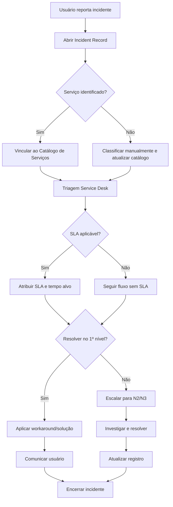

---

### Artefato: **Relatórios de Incidente**

### 🎯 Objetivo
Consolidar informações dos incidentes ocorridos em determinado período.

### 🔑 Explicação
- Relatórios diários, semanais ou mensais.
- Apresentam métricas: MTTR, MTTA, % de SLA atendido, volume de incidentes, reincidência.
- Identificam serviços mais impactados e tendências.
- Servem de insumo para Problem Management, Capacity Management e auditoria.

### 📈 Diagrama Mermaid
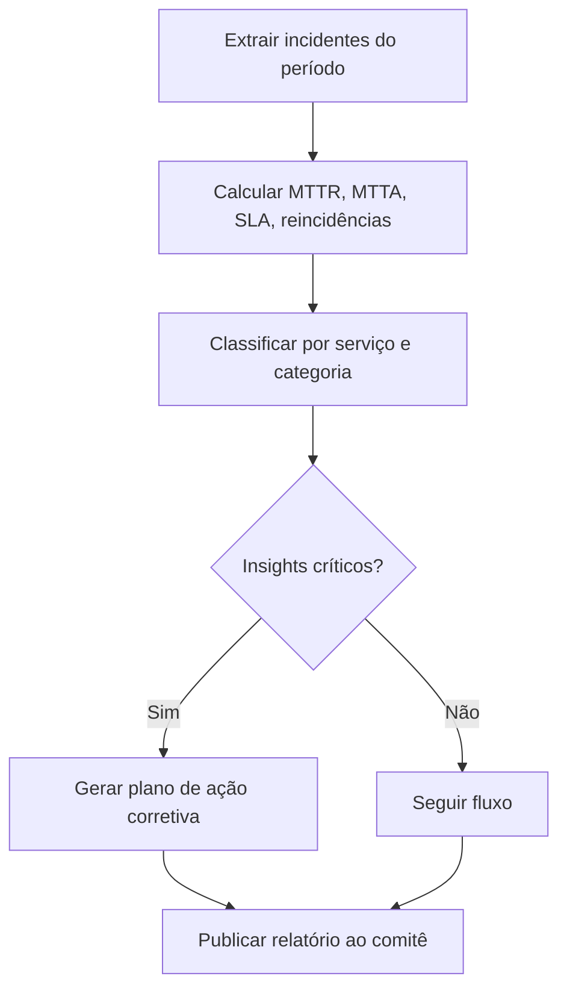

---

### Artefato: **Catálogo de Serviços (referência)**

### 🎯 Objetivo
Fornecer uma fonte única de referência para classificar incidentes, vinculando ao SLA correto.

### 🔑 Explicação
- Catálogo lista serviços disponíveis e seus SLAs.
- Incidente deve ser vinculado a um serviço.
- Garante aplicação do SLA, identificação de responsável e classificação estatística.
- Se serviço não existir, atualizar catálogo.

### 📈 Diagrama Mermaid
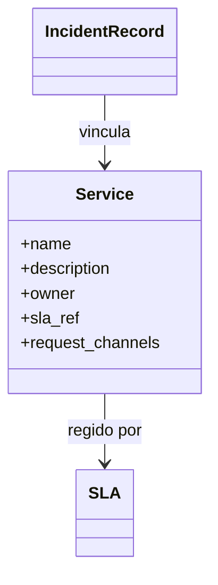

---


# 📘 Manual ITSM — Disciplina 2 (Problemas)

## 2. Problemas

### Artefato: **Registro de Problema (Problem Record)**

### 🎯 Objetivo
Documentar formalmente a investigação de incidentes recorrentes, identificando a causa-raiz e definindo ações corretivas ou preventivas.

### 🔑 Explicação
- Aberto a partir de incidentes recorrentes ou de alto impacto.
- Deve registrar serviços afetados, impacto, hipóteses de causa, evidências e planos de ação.
- Utiliza técnicas de RCA (5 Porquês, Ishikawa, análise de logs).
- Se identificada causa-raiz, gera uma Change Request.
- Caso não haja correção, define-se workaround documentado no KEDB.
- Encerrado após verificar eficácia da solução ou workaround.

### 📈 Diagrama Mermaid
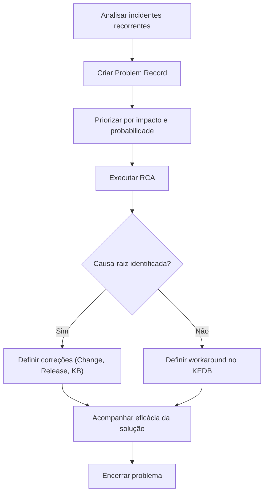

---
### Artefato: **KEDB (Known Error Database)**

### 🎯 Objetivo
Centralizar o conhecimento de erros conhecidos e workarounds para agilizar a resolução de incidentes.

### 🔑 Explicação
- Criado a partir de Problem Records.
- Contém sintomas, causa-raiz, workaround, CIs relacionados e status.
- Consultado pelo Service Desk para aplicar workarounds.
- Atualizado quando ocorre correção definitiva via Change.
- Faz a ponte entre Problem Management e Incident Management.

### 📈 Diagrama Mermaid
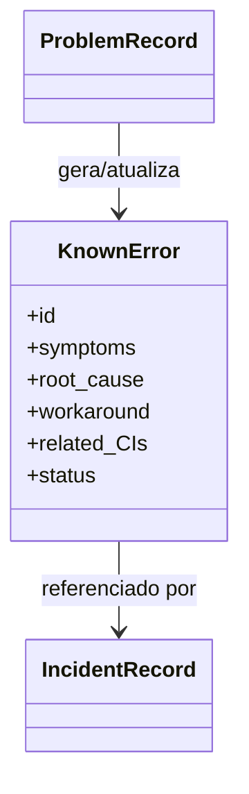

---
### Artefato: **Relatórios de Tendência**

### 🎯 Objetivo
Identificar padrões e tendências de incidentes e problemas ao longo do tempo.

### 🔑 Explicação
- Consolida informações históricas de incidentes e problemas.
- Produzido mensal ou trimestralmente.
- Destaca serviços mais impactados, categorias críticas, sazonalidade e efetividade das soluções.
- Orienta ações de Capacity Management, Change Enablement e Continuidade de Serviços.
- Usado em relatórios executivos e auditorias.

### 📈 Diagrama Mermaid
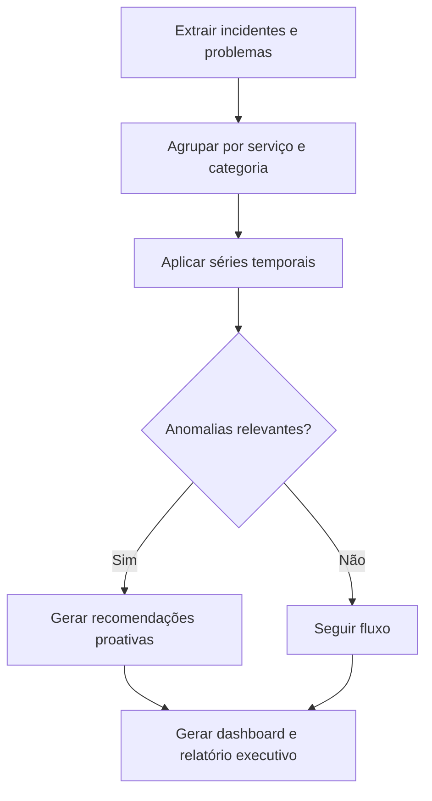

---


# 📘 Manual ITSM — Disciplina 3 (Mudancas)

## 3. Mudancas

### Artefato: **Change Request (CR)**

### 🎯 Objetivo
Formalizar a solicitação de mudança em serviços de TI, assegurando que impacto, custo, risco e benefícios sejam avaliados antes da execução.

### 🔑 Explicação
- Aberto quando há necessidade de alterar infraestrutura, aplicações, processos ou serviços.
- Documenta tipo de mudança, riscos, custos e plano de rollback.
- Avaliado e submetido ao CAB ou autoridade responsável.
- Se aprovado, segue para execução.
- Se rejeitado, é encerrado com justificativa.

### 📈 Diagrama Mermaid
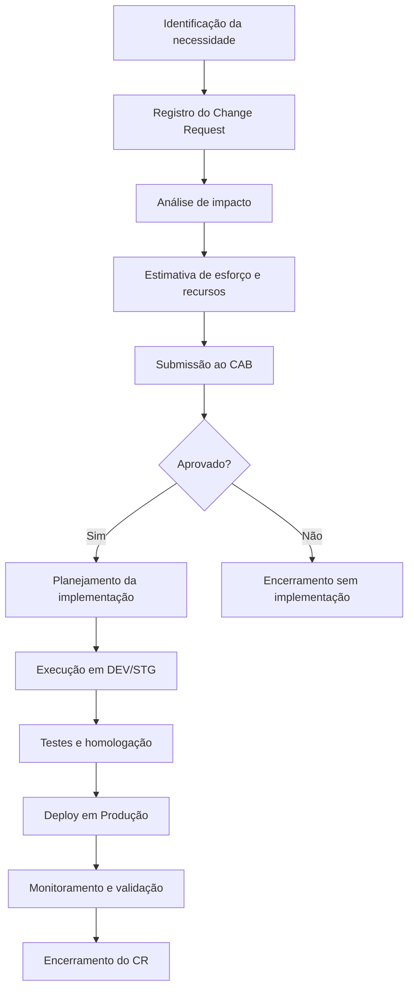

---
### Artefato: **Calendário de Mudanças (FSC)**

### 🎯 Objetivo
Consolidar mudanças aprovadas em um cronograma central, evitando conflitos e garantindo comunicação com áreas impactadas.

### 🔑 Explicação
- Atualizado sempre que uma mudança é aprovada.
- Contém janela de implementação, serviços impactados, responsáveis e nível de risco.
- Ajuda a coordenar equipes e prevenir sobreposição de mudanças críticas.
- Deve ser compartilhado com áreas de negócio, operações e segurança.

### 📈 Diagrama Mermaid
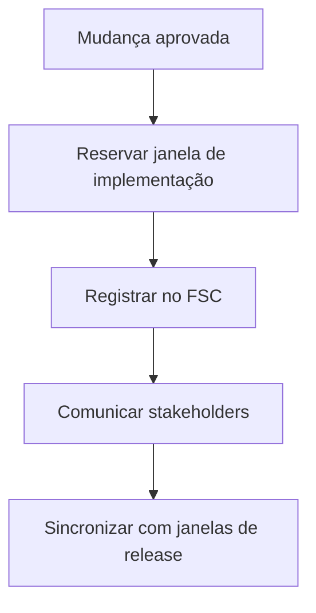

---
### Artefato: **Registro de Mudanças (Change Log)**

### 🎯 Objetivo
Manter o histórico completo de mudanças submetidas, aprovadas, rejeitadas ou concluídas.

### 🔑 Explicação
- Documenta desde a criação até o encerramento de cada mudança.
- Armazena identificador, solicitante, data, status, responsáveis e evidências.
- Permite auditoria, análise pós-implementação e rastreabilidade.
- Ciclo de vida controlado por estados: Criado → Em aprovação → Aprovado → Em implementação → Concluído ou Rollback.

### 📈 Diagrama Mermaid
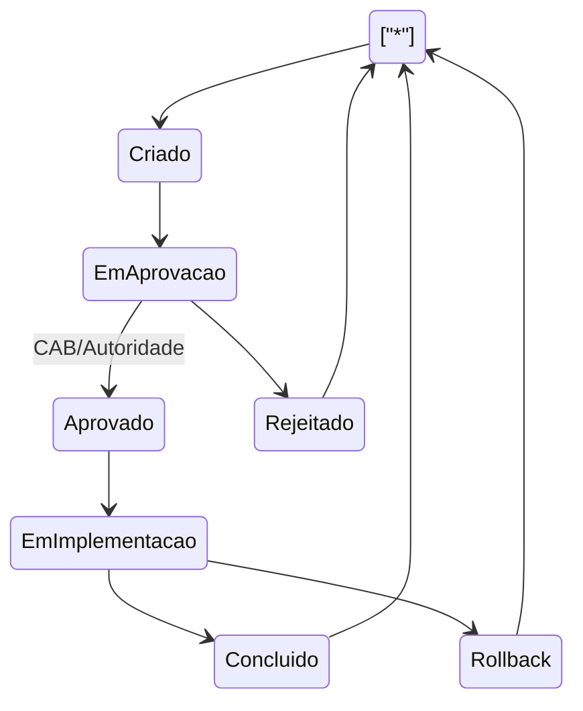

---


# 📘 Manual ITSM — Disciplina 4 (Liberacao)

## 4. Liberacao

### Artefato: **Plano de Release**

### 🎯 Objetivo
Planejar as atividades, recursos e cronograma necessários para entregar um release de forma controlada e segura.

### 🔑 Explicação
- Define escopo do release, janelas de implementação, riscos e rollback.
- Inclui planejamento de testes, comunicação com stakeholders e critérios de aceite.
- Aprovado pela gestão antes da execução.

### 📈 Diagrama Mermaid
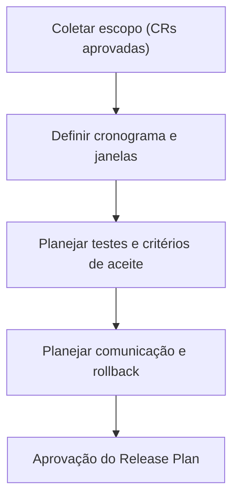

---
### Artefato: **Pacote de Release (Release Package)**

### 🎯 Objetivo
Consolidar todos os artefatos necessários para implementação de um release.

### 🔑 Explicação
- Inclui código, builds, scripts de deploy, notas de versão e planos de teste.
- Centraliza em um pacote único para garantir rastreabilidade.
- Facilita rollback caso necessário.

### 📈 Diagrama Mermaid
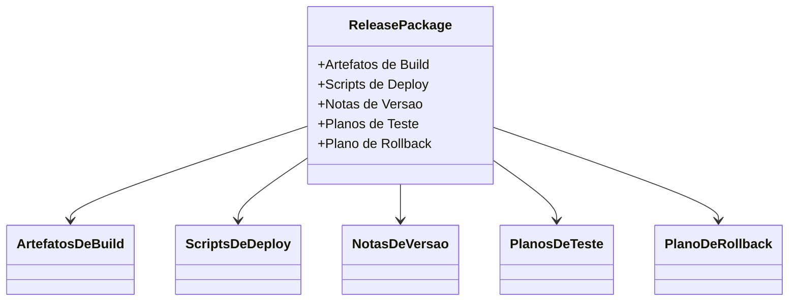

---
### Artefato: **Registro de Release**

### 🎯 Objetivo
Documentar a execução de um release e manter rastreabilidade para auditoria e suporte.

### 🔑 Explicação
- Criado automaticamente ou manualmente após execução do release.
- Contém versão, data, escopo, logs de deploy, resultados de testes.
- Utilizado para auditoria, suporte e histórico.

### 📈 Diagrama Mermaid
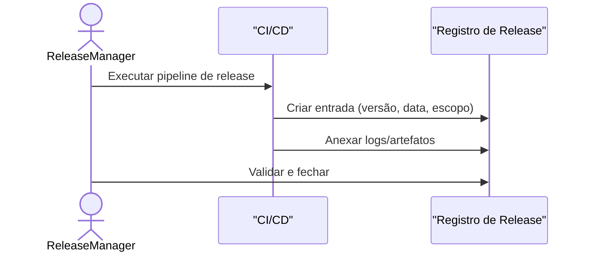

---


# 📘 Manual ITSM — Disciplina 5 (SACM)

## 5. SACM

### Artefato: **CMDB (Configuration Management Database)**

### 🎯 Objetivo
Centralizar informações sobre itens de configuração (CIs) e seus relacionamentos.

### 🔑 Explicação
- Repositório central que contém todos os itens de configuração (CIs).
- Permite identificar como componentes se relacionam para análise de impacto.
- Base para Incident, Problem, Change e Release Management.

### 📈 Diagrama Mermaid
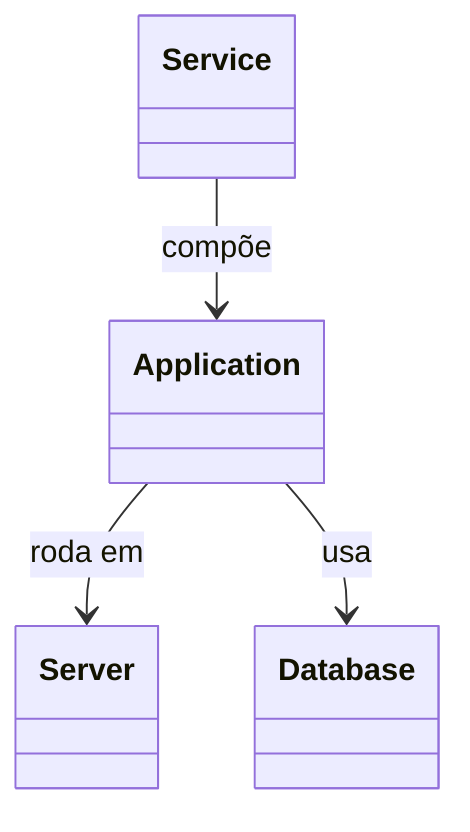

---
### Artefato: **Itens de Configuração (CIs)**

### 🎯 Objetivo
Representar componentes de TI que devem ser gerenciados ao longo de seu ciclo de vida.

### 🔑 Explicação
- Um CI pode ser hardware, software, documento, processo ou serviço.
- Cada CI é identificado de forma única na CMDB.
- O ciclo de vida inclui identificação, baseline, modificação e aposentadoria.

### 📈 Diagrama Mermaid
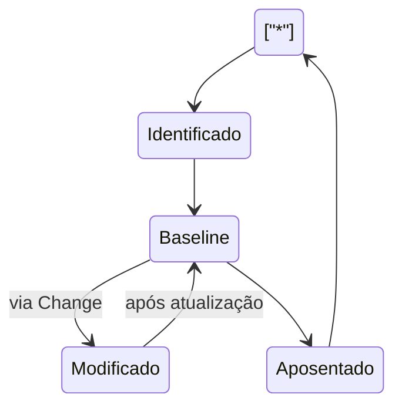

---
### Artefato: **Relatórios de Configuração**

### 🎯 Objetivo
Fornecer visibilidade sobre a integridade e consistência da CMDB.

### 🔑 Explicação
- Relatórios mostram relacionamentos entre CIs e sua conformidade.
- Detectam discrepâncias entre ambiente real e CMDB (drift).
- Usados para auditoria, governança e melhoria contínua.

### 📈 Diagrama Mermaid
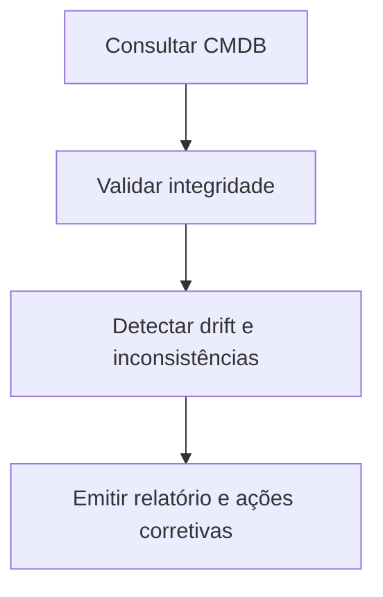

---


# 📘 Manual ITSM — Disciplina 6 (SLM)

## 6. SLM

### Artefato: **SLA (Service Level Agreement)**

### 🎯 Objetivo
Definir formalmente os níveis de serviço acordados entre TI e o negócio.

### 🔑 Explicação
- Documento que descreve serviços, métricas, metas e penalidades.
- Base para medir a qualidade do serviço entregue.
- Deve ser negociado e revisado periodicamente com as áreas de negócio.

### 📈 Diagrama Mermaid
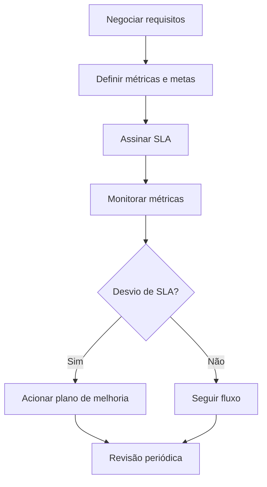

---
### Artefato: **OLA (Operational Level Agreement)**

### 🎯 Objetivo
Definir compromissos entre equipes internas de TI para suportar os SLAs.

### 🔑 Explicação
- Documento que formaliza acordos entre Service Desk, Infraestrutura, Desenvolvimento e outras áreas.
- Garante que os compromissos internos viabilizem o cumprimento dos SLAs externos.
- Contém tempos de resposta, responsabilidades e janelas de suporte.

### 📈 Diagrama Mermaid
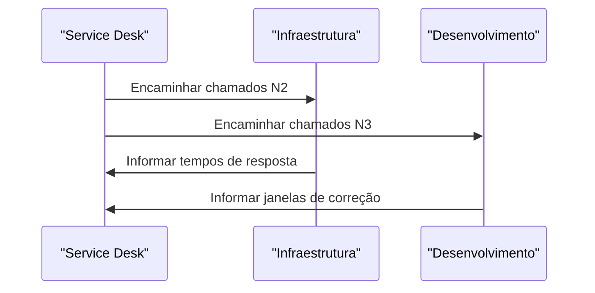

---
### Artefato: **Relatórios de SLA**

### 🎯 Objetivo
Consolidar a medição de desempenho dos serviços frente aos SLAs acordados.

### 🔑 Explicação
- Mostram indicadores como disponibilidade, tempo de resposta e cumprimento de SLOs.
- Destacam violações e ações corretivas.
- São apresentados em dashboards e relatórios executivos.

### 📈 Diagrama Mermaid
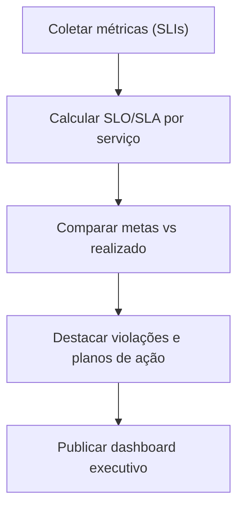

---


# 📘 Manual ITSM — Disciplina 7 (Catalogo)

## 7. Catalogo

### Artefato: **Catálogo de Serviços**

### 🎯 Objetivo
Manter informações atualizadas sobre todos os serviços disponíveis de TI.

### 🔑 Explicação
- Lista todos os serviços de TI oferecidos, com descrição, responsável, SLAs e canais de solicitação.
- Serve como ponto único de referência para usuários e equipes de TI.
- É a base para registro de incidentes e requisições.

### 📈 Diagrama Mermaid
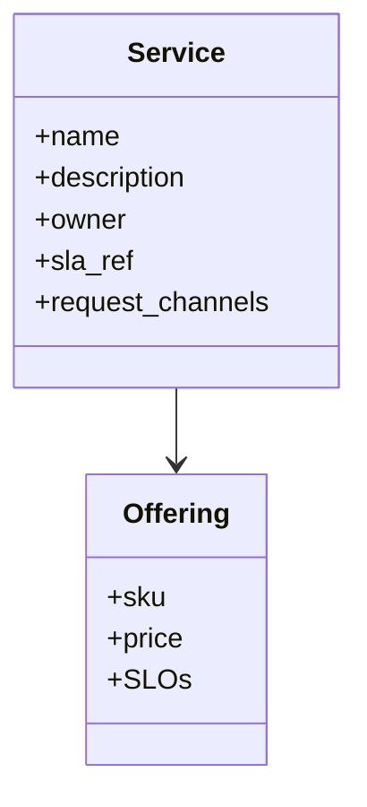

---
### Artefato: **Documentação de Ofertas de Serviço**

### 🎯 Objetivo
Formalizar a descrição detalhada de cada oferta publicada no catálogo.

### 🔑 Explicação
- Contém informações sobre escopo, SLOs, custos e requisitos.
- Deve ser revisada e aprovada antes da publicação.
- Garante alinhamento entre áreas técnicas, financeiras e de negócio.

### 📈 Diagrama Mermaid
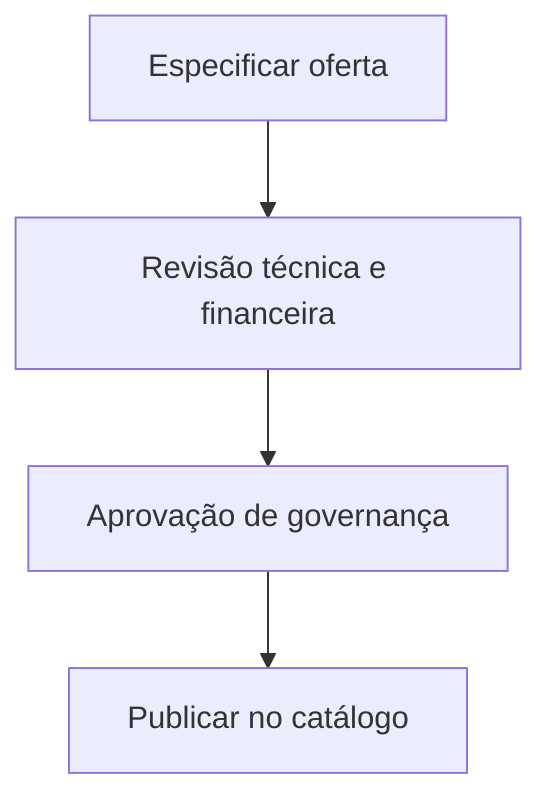

---


# 📘 Manual ITSM — Disciplina 8 (ITSCM)

## 8. ITSCM

### Artefato: **Plano de Continuidade de Serviços de TI (PCSTI)**

### 🎯 Objetivo
Assegurar a continuidade dos serviços críticos de TI em caso de incidentes graves ou desastres.

### 🔑 Explicação
- Elaborado a partir da Análise de Impacto no Negócio (BIA).
- Define RTO (Recovery Time Objective) e RPO (Recovery Point Objective).
- Inclui estratégias de redundância, contingência e testes periódicos.
- Revisado e atualizado regularmente com base em simulações.

### 📈 Diagrama Mermaid
```mermaid
flowchart TD
    A["Executar BIA"] --> B["Definir RTO/RPO"]
    B --> C["Planejar estratégias de continuidade"]
    C --> D["Documentar PCSTI"]
    D --> E["Treinar equipes"]
    E --> F["Testar periodicamente"]
    F --> G["Atualizar conforme lições aprendidas"]
```

---
### Artefato: **Plano de Recuperação de Desastres (DRP)**

### 🎯 Objetivo
Definir procedimentos detalhados para restaurar serviços de TI em caso de desastre.

### 🔑 Explicação
- Especifica como ativar o site de contingência ou recursos alternativos.
- Define responsáveis pela execução do plano.
- Inclui comunicação com stakeholders durante crises.
- Testado periodicamente para validar eficácia.

### 📈 Diagrama Mermaid
```mermaid
flowchart TD
    A["Detectar desastre"] --> B["Acionar comitê de crise"]
    B --> C["Failover para site secundário"]
    C --> D["Restaurar dados (RPO)"]
    D --> E["Validar serviços críticos (RTO)"]
    E --> F["Comunicar stakeholders"]
    F --> G["Retorno ao site primário (failback)"]
```

---
### Artefato: **Relatório de Testes de Continuidade**

### 🎯 Objetivo
Documentar os resultados dos testes de continuidade e os gaps identificados.

### 🔑 Explicação
- Elaborado após execução de testes de simulação.
- Contém cenários testados, tempos de recuperação e falhas observadas.
- Gera plano de ação para melhorias.
- Usado para auditoria e governança.

### 📈 Diagrama Mermaid
```mermaid
flowchart TD
    A["Definir cenário e objetivos"] --> B["Executar simulado"]
    B --> C["Coletar resultados"]
    C --> D["Identificar gaps"]
    D --> E["Emitir relatório e plano de ação"]
```

---


# 📘 Manual ITSM — Disciplina 9 (Disponibilidade)

## 9. Disponibilidade

### Artefato: **Relatórios de Disponibilidade**

### 🎯 Objetivo
Demonstrar o nível de disponibilidade dos serviços e comparar com as metas estabelecidas.

### 🔑 Explicação
- Elaborados mensalmente a partir de métricas de uptime e downtime.
- Excluem janelas de manutenção aprovadas.
- Identificam violações de SLA e pontos de melhoria.
- São usados para auditoria, governança e priorização de ações.

### 📈 Diagrama Mermaid
```mermaid
flowchart TD
    A["Coletar uptime/downtime"] --> B["Excluir janelas aprovadas"]
    B --> C["Calcular % de disponibilidade"]
    C --> D["Comparar com metas SLA"]
    D --> E["Emitir relatório"]
```

---
### Artefato: **Plano de Melhoria de Disponibilidade**

### 🎯 Objetivo
Definir ações para reduzir indisponibilidades e aumentar a resiliência dos serviços.

### 🔑 Explicação
- Elaborado a partir da análise dos relatórios de disponibilidade.
- Identifica Single Points of Failure (SPOFs).
- Planeja mitigação com alta disponibilidade, redundância ou otimizações.
- Inclui avaliação de custo-benefício e plano de implementação.

### 📈 Diagrama Mermaid
```mermaid
flowchart TD
    A["Identificar gargalos e SPOFs"] --> B["Desenhar soluções HA/redundância"]
    B --> C["Analisar custo-benefício"]
    C --> D["Executar mudanças planejadas"]
    D --> E["Monitorar impacto"]
```

---


# 📘 Manual ITSM — Disciplina 10 (Capacidade)

## 10. Capacidade

### Artefato: **Plano de Capacidade**

### 🎯 Objetivo
Garantir que a infraestrutura de TI suporte a demanda presente e futura.

### 🔑 Explicação
- Elaborado a partir de métricas de desempenho e crescimento.
- Define headroom de recursos e estratégias de expansão.
- Considera SLAs e Padrões de Atividade de Negócio (PBA).
- Revisado periodicamente e alinhado ao orçamento.

### 📈 Diagrama Mermaid
```mermaid
flowchart TD
    A["Coletar SLAs e PBAs"] --> B["Medir uso atual de recursos"]
    B --> C["Projetar crescimento futuro"]
    C --> D["Identificar gargalos"]
    D --> E["Planejar upgrades e otimizações"]
    E --> F["Aprovar Plano de Capacidade"]
```

---
### Artefato: **Relatórios de Capacidade**

### 🎯 Objetivo
Monitorar a utilização de recursos e identificar riscos de saturação.

### 🔑 Explicação
- Elaborados com base em métricas de CPU, memória, armazenamento e rede.
- Mostram headroom disponível e tendências de uso.
- Usados para ações preventivas e ajustes de capacidade.

### 📈 Diagrama Mermaid
```mermaid
flowchart TD
    A["Extrair métricas de uso"] --> B["Normalizar por serviço/ambiente"]
    B --> C["Calcular headroom e saturação"]
    C --> D["Gerar relatórios e alertas"]
```

---
### Artefato: **Modelos de Demanda**

### 🎯 Objetivo
Prever o consumo futuro de serviços com base em padrões de uso.

### 🔑 Explicação
- Utiliza sazonalidade, eventos especiais e crescimento orgânico.
- Baseado em Padrões de Atividade de Negócio (PBA).
- Alimenta o Plano de Capacidade para tomada de decisão.

### 📈 Diagrama Mermaid
```mermaid
classDiagram
    class ModeloDemanda {
      +Sazonalidade
      +Eventos
      +CrescimentoOrganico
      +PBA
    }

    ModeloDemanda --> `Previsão de Capacidade`

```

---


# 📘 Manual ITSM — Disciplina 11 (Seguranca)

## 11. Seguranca

### Artefato: **Políticas de Segurança**

### 🎯 Objetivo
Definir diretrizes e regras para proteger a confidencialidade, integridade e disponibilidade da informação.

### 🔑 Explicação
- Elaboradas com base em requisitos legais, normativos e regulatórios.
- Formalizam controles de segurança aplicáveis a pessoas, processos e tecnologia.
- Revisadas periodicamente para garantir adequação.
- Servem de base para auditorias de conformidade.

### 📈 Diagrama Mermaid
```mermaid
flowchart TD
    A["Identificar requisitos legais e normativos"] --> B["Redigir política de segurança"]
    B --> C["Revisão por stakeholders"]
    C --> D["Aprovação executiva"]
    D --> E["Publicar e treinar usuários"]
    E --> F["Revisão periódica e auditoria"]
```

---
### Artefato: **Relatórios de Auditoria de Segurança**

### 🎯 Objetivo
Registrar os resultados das auditorias de segurança, evidenciando conformidade ou não-conformidade.

### 🔑 Explicação
- Elaborados por equipes de auditoria interna ou externa.
- Contêm evidências coletadas, achados e recomendações.
- Servem para ajustes de políticas e controles.
- Exigem plano de ação para tratamento das não conformidades.

### 📈 Diagrama Mermaid
```mermaid
sequenceDiagram
    actor Auditor
    participant SIEM
    participant RE as "Repositório de Evidências"

    Auditor ->> SIEM: Solicitar eventos e relatórios
    SIEM ->> RE: Exportar evidências
    Auditor ->> RE: Analisar evidências
    Auditor ->> Auditor: Emitir achados e recomendações
```

---
### Artefato: **Registro de Incidentes de Segurança**

### 🎯 Objetivo
Documentar ocorrências que comprometem a segurança da informação.

### 🔑 Explicação
- Aberto quando um evento de segurança é detectado por sistemas ou usuários.
- Classificado por severidade e impacto.
- Deve registrar ações de contenção, erradicação e recuperação.
- Usado para aprendizado e melhoria de controles preventivos.

### 📈 Diagrama Mermaid
```mermaid
flowchart TD
    A["Detecção (SIEM ou usuário)"] --> B["Abrir ticket de segurança"]
    B --> C["Classificar severidade e impacto"]
    C --> D["Conter incidente"]
    D --> E["Erradicar e recuperar ambiente"]
    E --> F["Notificar stakeholders"]
    F --> G["Registrar lições aprendidas"]
```

---


# 📘 Manual ITSM — Disciplina 12 (Conhecimento)

## 12. Conhecimento

### Artefato: **Base de Conhecimento (Knowledge Base)**

### 🎯 Objetivo
Armazenar e organizar informações úteis para resolução de incidentes e requisições.

### 🔑 Explicação
- Repositório central de conhecimento para equipes de TI e usuários finais.
- Contém procedimentos, FAQs, manuais e workarounds.
- Reduz tempo de resolução e dependência de especialistas.
- Deve ser constantemente atualizado e validado.

### 📈 Diagrama Mermaid
```mermaid
classDiagram
    class KnowledgeBase
    class KnowledgeArticle {
      +id
      +title
      +problem
      +resolution
      +tags
      +status
    }

    class Tag {
      +name
    }

    KnowledgeBase --> KnowledgeArticle
    KnowledgeArticle --> Tag
```

---
### Artefato: **Artigos de Conhecimento (Knowledge Articles)**

### 🎯 Objetivo
Registrar e disponibilizar conteúdos específicos que resolvem problemas recorrentes ou instruem usuários.

### 🔑 Explicação
- Criados a partir de incidentes resolvidos, problemas ou solicitações comuns.
- Seguem fluxo de revisão e aprovação antes da publicação.
- Podem ser marcados como obsoletos quando não forem mais válidos.

### 📈 Diagrama Mermaid
```mermaid
stateDiagram-v2
    ["*"] --> Rascunho
    Rascunho --> Revisao : Submissão
    Revisao --> Aprovado : Validação SME
    Aprovado --> Publicado : Disponível na KB
    Publicado --> Obsoleto : Revisão periódica
    Obsoleto --> ["*"]
```

---


# 📘 Manual ITSM — Disciplina 13 (Requisicoes)

## 13. Requisicoes

### Artefato: **Registro de Requisição**

### 🎯 Objetivo
Registrar formalmente solicitações de serviço feitas por usuários.

### 🔑 Explicação
- Criado a partir do Catálogo de Serviços.
- Classifica a requisição por tipo, prioridade e impacto.
- Pode requerer aprovação do gestor antes da execução.
- Permite rastreabilidade e medição de prazos de atendimento.

### 📈 Diagrama Mermaid
```mermaid
flowchart TD
    A["Usuário solicita serviço no Catálogo"] --> B["Registrar requisição"]
    B --> C{"Aprovação necessária?"}
    C -->|Sim| D["Solicitar aprovação do gestor"]
    D --> E{"Aprovado?"}
    E -->|Sim| F["Prosseguir atendimento"]
    E -->|Não| G["Encerrar por reprovação"]
    C -->|Não| F
    F --> H["Executar atendimento"]
    H --> I["Validar com o usuário"]
    I --> J["Encerrar requisição"]
```

---
### Artefato: **Relatórios de Atendimentos**

### 🎯 Objetivo
Consolidar métricas e indicadores das requisições de serviço.

### 🔑 Explicação
- Apresentam número de requisições atendidas, tempo médio de atendimento e taxa de aprovação.
- Permitem identificar gargalos e oportunidades de automação.
- Usados para auditoria e melhoria contínua.

### 📈 Diagrama Mermaid
```mermaid
flowchart TD
    A["Extrair requisições atendidas no período"] --> B["Calcular lead time e backlog"]
    B --> C["Gerar indicadores de aprovação"]
    C --> D["Identificar gargalos"]
    D --> E["Publicar relatório"]
```

---


# 📘 Manual ITSM — Disciplina 14 (Financeiro)

## 14. Financeiro

### Artefato: **Relatórios Financeiros**

### 🎯 Objetivo
Demonstrar os custos e investimentos associados aos serviços de TI.

### 🔑 Explicação
- Consolidam despesas com infraestrutura, licenças, pessoal e terceiros.
- Podem ser apresentados como showback (informativo) ou chargeback (rateio real).
- Usados para planejamento estratégico e auditoria.

### 📈 Diagrama Mermaid
```mermaid
flowchart TD
    A["Coletar custos de TI"] --> B["Alocar custos por serviço"]
    B --> C["Gerar relatórios por centro de custo"]
    C --> D["Enviar showback/chargeback ao negócio"]
```

---
### Artefato: **Orçamento de Serviços**

### 🎯 Objetivo
Planejar os gastos de TI para determinado período e acompanhar sua execução.

### 🔑 Explicação
- Estimado com base em previsões de demanda e custos históricos.
- Definido em ciclos anuais ou trimestrais.
- Acompanhado via forecast para ajustes e correções.
- Necessário para garantir governança e priorização de investimentos.

### 📈 Diagrama Mermaid
```mermaid
flowchart TD
    A["Estimar custos e demanda futura"] --> B["Definir orçamento anual/trimestral"]
    B --> C["Aprovação executiva"]
    C --> D["Monitorar execução orçamentária"]
    D --> E["Realizar revisões (forecast)"]
```

---
### Artefato: **Planilhas de Custos**

### 🎯 Objetivo
Manter o detalhamento granular dos custos de TI, possibilitando rastreabilidade.

### 🔑 Explicação
- Atualizadas periodicamente pelas equipes de FinOps ou controladoria.
- Integram dados de diversos sistemas financeiros.
- Servem de base para relatórios e auditorias.
- Auxiliam na identificação de desperdícios e otimizações.

### 📈 Diagrama Mermaid
```mermaid
sequenceDiagram
    actor FinOps
    participant PC as "Planilha de Custos"
    participant DWF as "DW Financeiro"

    FinOps ->> PC: Atualizar custos e premissas
    PC ->> DWF: Importar dados consolidados
    FinOps ->> DWF: Analisar e publicar relatórios
```

---


# 📘 Manual ITSM — Disciplina 15 (Portfolio)

## 15. Portfolio

### Artefato: **Portfólio de Serviços**

### 🎯 Objetivo
Manter a visão completa de todos os serviços de TI ao longo de seu ciclo de vida.

### 🔑 Explicação
- Inclui serviços em pipeline, em desenvolvimento, ativos em produção e aposentados.
- Permite priorizar investimentos e alinhar o portfólio à estratégia do negócio.
- É atualizado continuamente para refletir mudanças no ambiente de TI.

### 📈 Diagrama Mermaid
```mermaid
stateDiagram-v2
    ["*"] --> Pipeline
    Pipeline --> EmDesenvolvimento
    EmDesenvolvimento --> EmProducao
    EmProducao --> Aposentado
    Aposentado --> ["*"]
```

---
### Artefato: **Justificativas de Serviço (Business Case)**

### 🎯 Objetivo
Apresentar os motivos e benefícios de criar ou manter um serviço no portfólio.

### 🔑 Explicação
- Elaboradas com base em análise de ROI, riscos e alinhamento estratégico.
- Avaliadas por comitês de governança antes da aprovação.
- Servem para priorizar investimentos em novos serviços.

### 📈 Diagrama Mermaid
```mermaid
flowchart TD
    A["Identificar necessidade de negócio"] --> B["Elaborar Business Case"]
    B --> C["Avaliar alinhamento estratégico"]
    C --> D{"Viável e estratégico?"}
    D -->|Sim| E["Aprovar entrada no portfólio"]
    D -->|Não| F["Rejeitar proposta"]
```

---


# 📘 Manual ITSM — Disciplina 16 (Demanda)

## 16. Demanda

### Artefato: **Padrões de Atividade de Negócio (PBA)**

### 🎯 Objetivo
Registrar os padrões de comportamento e sazonalidade da demanda por serviços.

### 🔑 Explicação
- Coletados a partir da análise de uso de sistemas e processos de negócio.
- Identificam horários de pico, sazonalidade e eventos especiais.
- Servem de insumo para Capacity Management e planejamento estratégico.

### 📈 Diagrama Mermaid
```mermaid
flowchart TD
    A["Coletar métricas de uso por horário/dia"] --> B["Identificar sazonalidade e picos"]
    B --> C["Documentar PBA"]
    C --> D["Compartilhar com Capacity/Availability"]
```

---
### Artefato: **Relatórios de Consumo**

### 🎯 Objetivo
Consolidar o consumo real de serviços de TI, comparando com previsões de demanda.

### 🔑 Explicação
- Apresentam dados como número de usuários, transações, chamadas de API ou uso de armazenamento.
- Comparados com previsões para detectar desvios e ajustar capacidade.
- Suportam planejamento financeiro e decisões de escalabilidade.

### 📈 Diagrama Mermaid
```mermaid
flowchart TD
    A["Coletar métricas de consumo"] --> B["Consolidar por serviço e unidade de negócio"]
    B --> C["Comparar com forecast de demanda"]
    C --> D["Gerar relatórios executivos"]
```

---


