# 📘 Manual Completo de Disciplinas e Artefatos do ITSM


## 1. Gerenciamento de Incidentes (Incident Management)

### Artefato: **Registro de Incidente (Incident Record)**

### 🎯 Objetivo
Registrar formalmente cada incidente, assegurando rastreabilidade, correta classificação, aplicação de SLA e resolução adequada.

### 🔑 Explicação
- Aberto quando usuário ou monitoramento reporta incidente.
- Deve conter impacto, urgência, prioridade e serviço impactado.
- Associado ao Catálogo de Serviços para aplicar SLA correto.
- Pode ser resolvido no 1º nível ou escalado.
- Encerrado após validação da solução com o usuário.
- Todo histórico é registrado para relatórios e análises futuras.

### 📈 Diagrama PlantUML
```plantuml
@startuml
title Fluxo do Registro de Incidente

start
:Usuário reporta incidente;
:Abrir Incident Record;
if (Serviço identificado?) then (Sim)
  :Vincular ao Catálogo de Serviços;
else (Não)
  :Classificar manualmente e atualizar catálogo;
endif
:Triagem Service Desk;
if (SLA aplicável?) then (Sim)
  :Atribuir SLA e tempo alvo;
endif
if (Resolver no 1º nível?) then (Sim)
  :Aplicar workaround;
  :Comunicar usuário;
  :Encerrar incidente;
else (Não)
  :Escalar para N2/N3;
  :Investigar e resolver;
  :Atualizar registro;
  :Encerrar incidente;
endif
stop
@enduml
```

---

### Artefato: **Relatórios de Incidente**

### 🎯 Objetivo
Consolidar informações dos incidentes ocorridos em determinado período.

### 🔑 Explicação
- Relatórios diários, semanais ou mensais.
- Apresentam métricas: MTTR, MTTA, % de SLA atendido, volume de incidentes, reincidência.
- Identificam serviços mais impactados e tendências.
- Servem de insumo para Problem Management, Capacity Management e auditoria.

### 📈 Diagrama PlantUML
```plantuml
@startuml
title Geração de Relatórios de Incidentes (Mensal)

start
:Extrair incidentes do período;
:Calcular MTTR, MTTA, SLA, reincidências;
:Classificar por serviço, categoria;
if (Insights críticos?) then (Sim)
  :Gerar plano de ação corretiva;
endif
:Publicar relatório ao comitê;
stop
@enduml
```

---

### Artefato: **Catálogo de Serviços (referência)**

### 🎯 Objetivo
Fornecer uma fonte única de referência para classificar incidentes, vinculando ao SLA correto.

### 🔑 Explicação
- Catálogo lista serviços disponíveis e seus SLAs.
- Incidente deve ser vinculado a um serviço.
- Garante aplicação do SLA, identificação de responsável e classificação estatística.
- Se serviço não existir, atualizar catálogo.

### 📈 Diagrama PlantUML
```plantuml
@startuml
title Referenciamento de Incidente ao Catálogo de Serviços

package "Service Catalog" {
  [Serviço A] as A
  [Serviço B] as B
  [SLA/OLA] as SLA
}

[Incident Record] --> A
[Incident Record] --> B
A ..> SLA
B ..> SLA
@enduml
```

---


# 📘 Manual ITSM — Disciplina 2

## 2. Gerenciamento de Problemas (Problem Management)

### Artefato: **Registro de Problema (Problem Record)**

### 🎯 Objetivo
Documentar formalmente a investigação de incidentes recorrentes, identificando a causa-raiz e definindo ações corretivas ou preventivas.

### 🔑 Explicação
- Aberto a partir de incidentes recorrentes ou de alto impacto.
- Deve registrar serviços afetados, impacto, hipóteses de causa, evidências e planos de ação.
- Utiliza técnicas de RCA (5 Porquês, Ishikawa, análise de logs).
- Se identificada causa-raiz, gera uma Change Request.
- Caso não haja correção, define-se workaround documentado no KEDB.
- Encerrado após verificar eficácia da solução ou workaround.

### 📈 Diagrama PlantUML


---

### Artefato: **KEDB (Known Error Database)**

### 🎯 Objetivo
Centralizar o conhecimento de erros conhecidos e workarounds para agilizar a resolução de incidentes.

### 🔑 Explicação
- Criado a partir de Problem Records.
- Contém sintomas, causa-raiz, workaround, CIs relacionados e status.
- Consultado pelo Service Desk para aplicar workarounds.
- Atualizado quando ocorre correção definitiva via Change.
- Faz a ponte entre Problem Management e Incident Management.

### 📈 Diagrama PlantUML
```plantuml
@startuml
title Estrutura Lógica do KEDB

class KnownError {
  id
  symptoms
  root_cause
  workaround
  related_CIs
  status
}

class IncidentRecord
class ProblemRecord

KnownError "1" -- "*" IncidentRecord : referenciado por
ProblemRecord "1" -- "*" KnownError : gera/atualiza
@enduml
```

---

### Artefato: **Relatórios de Tendência**

### 🎯 Objetivo
Identificar padrões e tendências de incidentes e problemas ao longo do tempo.

### 🔑 Explicação
- Consolida informações históricas de incidentes e problemas.
- Produzido mensal ou trimestralmente.
- Destaca serviços mais impactados, categorias críticas, sazonalidade e efetividade das soluções.
- Orienta ações de Capacity Management, Change Enablement e Continuidade de Serviços.
- Usado em relatórios executivos e auditorias.

### 📈 Diagrama PlantUML
```plantuml
@startuml
title Pipeline de Relatório de Tendências

start
:Extrair incidentes e problemas do período;
:Agrupar por serviço e categoria;
:Aplicar séries temporais (mensal, trimestral);
:Detectar picos e sazonalidade;

if (Anomalias relevantes?) then (Sim)
  :Gerar recomendações de ações proativas;
endif

:Gerar dashboard e relatório executivo;
stop
@enduml
```

---


# 📘 Manual ITSM — Disciplina 3

## 3. Gerenciamento de Mudanças (Change Management)

### Artefato: **Change Request (CR)**

### 🎯 Objetivo
Formalizar a solicitação de mudança em serviços de TI, assegurando que impacto, custo, risco e benefícios sejam avaliados antes da execução.

### 🔑 Explicação
- Aberto quando há necessidade de alterar infraestrutura, aplicações, processos ou serviços.
- Documenta tipo de mudança (corretiva, adaptativa, evolutiva, preventiva), riscos, custos e plano de rollback.
- Avaliado e submetido ao CAB ou autoridade responsável.
- Se aprovado, segue para planejamento, execução e implantação.
- Se rejeitado, é encerrado com justificativa.

### 📈 Diagrama PlantUML
```plantuml
@startuml
title Fluxo de Change Request

start
:Identificação da necessidade;
:Registro do Change Request;
if (Classificação da mudança) then (Corretiva/Adaptativa/Preventiva/Evolutiva)
  :Registrar tipo de CR;
endif
:Análise de impacto;
:Estimativa de esforço e recursos;
:Submissão ao CAB;

if (Aprovado?) then (Sim)
  :Planejamento da implementação;
  :Execução em DEV/STG;
  :Testes e homologação;
  :Deploy em produção;
  :Monitoramento e validação;
  :Encerramento do CR;
else (Não)
  :Encerramento sem implementação;
endif

stop
@enduml
```

---

### Artefato: **Calendário de Mudanças (Forward Schedule of Change – FSC)**

### 🎯 Objetivo
Consolidar mudanças aprovadas em um cronograma central, evitando conflitos e garantindo comunicação com áreas impactadas.

### 🔑 Explicação
- Atualizado sempre que uma mudança é aprovada.
- Contém janela de implementação, serviços impactados, responsáveis e nível de risco.
- Ajuda a coordenar equipes e prevenir sobreposição de mudanças críticas.
- Deve ser compartilhado com áreas de negócio, operações e segurança.

### 📈 Diagrama PlantUML
```plantuml
@startuml
title Publicação no FSC

start
:Mudança aprovada;
:Reservar janela de implementação;
:Registrar no FSC (serviço, impacto, janela);
:Comunicar stakeholders;
:Sincronizar com janelas de release;
stop
@enduml
```

---

### Artefato: **Registro de Mudanças (Change Log)**

### 🎯 Objetivo
Manter o histórico completo de mudanças submetidas, aprovadas, rejeitadas ou concluídas.

### 🔑 Explicação
- Documenta desde a criação até o encerramento de cada mudança.
- Armazena identificador, solicitante, data, status, responsáveis e evidências.
- Permite auditoria, análise pós-implementação e rastreabilidade.
- Ciclo de vida controlado por estados: Criado → Em aprovação → Aprovado → Em implementação → Concluído ou Rollback.

### 📈 Diagrama PlantUML
```plantuml
@startuml
title Ciclo de Vida do Registro de Mudança

state Registro {
  [*] --> Criado
  Criado --> EmAprovação
  EmAprovação --> Aprovado : CAB/Autoridade
  EmAprovação --> Rejeitado
  Aprovado --> EmImplementação
  EmImplementação --> Concluído
  EmImplementação --> Rollback
  Concluído --> [*]
  Rejeitado --> [*]
  Rollback --> [*]
}
@enduml
```

---


# 📘 Manual ITSM — Disciplina 4

## 4. Gerenciamento de Liberação (Release Management)

### Artefato: **Plano de Release**

### 🎯 Objetivo
Planejar as atividades, recursos e cronograma necessários para entregar um release de forma controlada e segura.

### 🔑 Explicação
- Define escopo do release, janelas de implementação, riscos e estratégias de rollback.
- Inclui planejamento de testes, comunicação com stakeholders e critérios de aceite.
- Aprovado pela gestão antes da execução.

### 📈 Diagrama PlantUML
```plantuml
@startuml
title Planejamento de Release

start
:Coletar escopo (CRs aprovadas);
:Definir cronograma e janelas;
:Planejar testes e critérios de aceite;
:Planejar comunicação e rollback;
:Aprovação do Release Plan;
stop
@enduml
```

---

### Artefato: **Pacote de Release (Release Package)**

### 🎯 Objetivo
Consolidar todos os artefatos necessários para implementação de um release.

### 🔑 Explicação
- Inclui código, builds, scripts de deploy, notas de versão e planos de teste.
- Centraliza em um pacote único para garantir rastreabilidade.
- Facilita rollback caso necessário.

### 📈 Diagrama PlantUML


---

### Artefato: **Registro de Release**

### 🎯 Objetivo
Documentar a execução de um release e manter rastreabilidade para auditoria e suporte.

### 🔑 Explicação
- Criado automaticamente ou manualmente após execução do release.
- Contém versão, data, escopo, logs de deploy, resultados de testes.
- Utilizado para auditoria, suporte e histórico.

### 📈 Diagrama PlantUML
```plantuml
@startuml
title Registro de Release (Sequência)

actor ReleaseManager
participant "CI/CD" as CICD
database "Registro de Release" as RR

ReleaseManager -> CICD : Executar pipeline de release
CICD -> RR : Criar entrada (versão, data, escopo)
CICD -> RR : Anexar logs/artefatos
ReleaseManager -> RR : Validar e fechar
@enduml
```

---


# 📘 Manual ITSM — Disciplina 5

## 5. Gerenciamento de Configuração e Ativos (SACM)

### Artefato: **CMDB (Configuration Management Database)**

### 🎯 Objetivo
Centralizar informações sobre itens de configuração (CIs) e seus relacionamentos.

### 🔑 Explicação
- Repositório central que contém todos os itens de configuração (CIs).
- Permite identificar como componentes se relacionam para análise de impacto.
- Base para Incident, Problem, Change e Release Management.

### 📈 Diagrama PlantUML
```plantuml
@startuml
title Modelo Simplificado de CMDB

class Service
class Application
class Server
class Database

Service "1" -- "*" Application : compõe
Application "*" -- "*" Server : roda em
Application "*" -- "1" Database : usa
@enduml
```

---

### Artefato: **Itens de Configuração (CIs)**

### 🎯 Objetivo
Representar componentes de TI que devem ser gerenciados ao longo de seu ciclo de vida.

### 🔑 Explicação
- Um CI pode ser hardware, software, documento, processo ou serviço.
- Cada CI é identificado de forma única na CMDB.
- O ciclo de vida inclui identificação, baseline, modificação e aposentadoria.

### 📈 Diagrama PlantUML
```plantuml
@startuml
title Ciclo de Vida de um CI

state CI {
  [*] --> Identificado
  Identificado --> Baseline
  Baseline --> Modificado : via Change
  Modificado --> Baseline : após atualização
  Baseline --> Aposentado
  Aposentado --> [*]
}
@enduml
```

---

### Artefato: **Relatórios de Configuração**

### 🎯 Objetivo
Fornecer visibilidade sobre a integridade e consistência da CMDB.

### 🔑 Explicação
- Relatórios mostram relacionamentos entre CIs e sua conformidade.
- Detectam discrepâncias entre ambiente real e CMDB (drift).
- Usados para auditoria, governança e melhoria contínua.

### 📈 Diagrama PlantUML
```plantuml
@startuml
title Geração de Relatórios de Configuração

start
:Consultar CMDB;
:Validar integridade (descoberta vs CMDB);
:Detectar drift e relacionamentos quebrados;
:Emitir relatório e ações corretivas;
stop
@enduml
```

---


# 📘 Manual ITSM — Disciplina 6

## 6. Gerenciamento de Nível de Serviço (SLM)

### Artefato: **SLA (Service Level Agreement)**

### 🎯 Objetivo
Definir formalmente os níveis de serviço acordados entre TI e o negócio.

### 🔑 Explicação
- Documento que descreve serviços, métricas, metas e penalidades.
- Base para medir a qualidade do serviço entregue.
- Deve ser negociado e revisado periodicamente com as áreas de negócio.

### 📈 Diagrama PlantUML
```plantuml
@startuml
title Ciclo de SLA

start
:Negociar requisitos com o negócio;
:Definir métricas, metas, penalidades;
:Assinar SLA;
:Monitorar métricas (SLI/SLO);
if (Desvio de SLA?) then (Sim)
  :Acionar plano de melhoria;
endif
:Revisão periódica;
stop
@enduml
```

---

### Artefato: **OLA (Operational Level Agreement)**

### 🎯 Objetivo
Definir compromissos entre equipes internas de TI para suportar os SLAs.

### 🔑 Explicação
- Documento que formaliza acordos entre Service Desk, Infraestrutura, Desenvolvimento e outras áreas.
- Garante que os compromissos internos viabilizem o cumprimento dos SLAs externos.
- Contém tempos de resposta, responsabilidades e janelas de suporte.

### 📈 Diagrama PlantUML
```plantuml
@startuml
title Fluxo de OLA

participant "Service Desk" as SD
participant "Infraestrutura" as INF
participant "Desenvolvimento" as DEV

SD -> INF : Encaminhar chamados N2
SD -> DEV : Encaminhar chamados N3
INF -> SD : Informar tempos de resposta
DEV -> SD : Informar janelas de correção

note over SD, INF, DEV
  O OLA garante alinhamento interno para
  cumprir o SLA acordado com o negócio.
end note
@enduml
```

---

### Artefato: **Relatórios de SLA**

### 🎯 Objetivo
Consolidar a medição de desempenho dos serviços frente aos SLAs acordados.

### 🔑 Explicação
- Mostram indicadores como disponibilidade, tempo de resposta e cumprimento de SLOs.
- Destacam violações e ações corretivas.
- São apresentados em dashboards e relatórios executivos.

### 📈 Diagrama PlantUML
```plantuml
@startuml
title Relatório de SLA

start
:Coletar métricas (SLIs);
:Calcular SLO/SLA por serviço;
:Comparar metas vs realizado;
:Destacar violações e planos de ação;
:Publicar dashboard executivo;
stop
@enduml
```

---


# 📘 Manual ITSM — Disciplina 7

## 7. Gerenciamento de Catálogo de Serviços (Service Catalog Management)

### Artefato: **Catálogo de Serviços**

### 🎯 Objetivo
Manter informações atualizadas sobre todos os serviços disponíveis de TI.

### 🔑 Explicação
- Lista todos os serviços de TI oferecidos, com descrição, responsável, SLAs e canais de solicitação.
- Serve como ponto único de referência para usuários e equipes de TI.
- É a base para registro de incidentes e requisições.

### 📈 Diagrama PlantUML
```plantuml
@startuml
title Estrutura do Catálogo de Serviços

class Service {
  name
  description
  owner
  sla_ref
  request_channels
}

class Offering { sku, price, SLOs }

Service "1" -- "*" Offering
@enduml
```

---

### Artefato: **Documentação de Ofertas de Serviço**

### 🎯 Objetivo
Formalizar a descrição detalhada de cada oferta publicada no catálogo.

### 🔑 Explicação
- Contém informações sobre escopo, SLOs, custos e requisitos.
- Deve ser revisada e aprovada antes da publicação.
- Garante alinhamento entre áreas técnicas, financeiras e de negócio.

### 📈 Diagrama PlantUML
```plantuml
@startuml
title Aprovação de Oferta de Serviço

start
:Especificar oferta (escopo, SLO, preço);
:Revisão técnica e financeira;
:Aprovação de governança;
:Publicar no catálogo;
stop
@enduml
```

---


# 📘 Manual ITSM — Disciplina 8

## 8. Gerenciamento de Continuidade de Serviço de TI (ITSCM)

### Artefato: **Plano de Continuidade de Serviços de TI (PCSTI)**

### 🎯 Objetivo
Assegurar a continuidade dos serviços críticos de TI em caso de incidentes graves ou desastres.

### 🔑 Explicação
- Elaborado a partir da Análise de Impacto no Negócio (BIA).
- Define RTO (Recovery Time Objective) e RPO (Recovery Point Objective).
- Inclui estratégias de redundância, contingência e testes periódicos.
- Revisado e atualizado regularmente com base em simulações.

### 📈 Diagrama PlantUML
```plantuml
@startuml
title Ciclo do ITSCM

start
:Executar BIA (Business Impact Analysis);
:Definir RTO/RPO;
:Planejar estratégias de continuidade;
:Documentar PCSTI;
:Treinar equipes;
:Testar periodicamente;
:Atualizar conforme lições aprendidas;
stop
@enduml
```

---

### Artefato: **Plano de Recuperação de Desastres (DRP)**

### 🎯 Objetivo
Definir procedimentos detalhados para restaurar serviços de TI em caso de desastre.

### 🔑 Explicação
- Especifica como ativar o site de contingência ou recursos alternativos.
- Define responsáveis pela execução do plano.
- Inclui comunicação com stakeholders durante crises.
- Testado periodicamente para validar eficácia.

### 📈 Diagrama PlantUML
```plantuml
@startuml
title Execução do DRP

start
:Detectar desastre;
:Acionar comitê de crise;
:Failover para site secundário;
:Restaurar dados (RPO);
:Validar serviços críticos (RTO);
:Comunicar stakeholders;
:Retorno ao site primário (failback);
stop
@enduml
```

---

### Artefato: **Relatório de Testes de Continuidade**

### 🎯 Objetivo
Documentar os resultados dos testes de continuidade e os gaps identificados.

### 🔑 Explicação
- Elaborado após execução de testes de simulação.
- Contém cenários testados, tempos de recuperação e falhas observadas.
- Gera plano de ação para melhorias.
- Usado para auditoria e governança.

### 📈 Diagrama PlantUML
```plantuml
@startuml
title Teste de Continuidade — Relatório

start
:Definir cenário e objetivos;
:Executar simulado;
:Coletar resultados;
:Identificar gaps;
:Emitir relatório e plano de ação;
stop
@enduml
```

---


# 📘 Manual ITSM — Disciplina 9

## 9. Gerenciamento de Disponibilidade (Availability Management)

### Artefato: **Relatórios de Disponibilidade**

### 🎯 Objetivo
Demonstrar o nível de disponibilidade dos serviços e comparar com as metas estabelecidas.

### 🔑 Explicação
- Elaborados mensalmente a partir de métricas de uptime e downtime.
- Excluem janelas de manutenção aprovadas.
- Identificam violações de SLA e pontos de melhoria.
- São usados para auditoria, governança e priorização de ações.

### 📈 Diagrama PlantUML
```plantuml
@startuml
title Cálculo de Disponibilidade Mensal

start
:Coletar uptime/downtime;
:Excluir janelas aprovadas;
:Calcular % de disponibilidade;
:Comparar com metas SLA;
:Emitir relatório;
stop
@enduml
```

---

### Artefato: **Plano de Melhoria de Disponibilidade**

### 🎯 Objetivo
Definir ações para reduzir indisponibilidades e aumentar a resiliência dos serviços.

### 🔑 Explicação
- Elaborado a partir da análise dos relatórios de disponibilidade.
- Identifica Single Points of Failure (SPOFs).
- Planeja mitigação com alta disponibilidade, redundância ou otimizações.
- Inclui avaliação de custo-benefício e plano de implementação.

### 📈 Diagrama PlantUML
```plantuml
@startuml
title Ciclo de Melhoria de Disponibilidade

start
:Identificar gargalos e SPOFs;
:Desenhar soluções (HA, redundância);
:Analisar custo-benefício;
:Executar mudanças planejadas;
:Monitorar impacto;
stop
@enduml
```

---


0

## 10. Gerenciamento de Capacidade (Capacity Management)

### Artefato: **Plano de Capacidade**

### 🎯 Objetivo
Garantir que a infraestrutura de TI suporte a demanda presente e futura.

### 🔑 Explicação
- Elaborado a partir de métricas de desempenho e crescimento.
- Define headroom de recursos e estratégias de expansão.
- Considera SLAs e Padrões de Atividade de Negócio (PBA).
- Revisado periodicamente e alinhado ao orçamento.

### 📈 Diagrama PlantUML
```plantuml
@startuml
title Elaboração do Plano de Capacidade

start
:Coletar SLAs e PBAs;
:Medir uso atual de recursos;
:Projetar crescimento futuro;
:Identificar gargalos;
:Planejar upgrades e otimizações;
:Aprovar Plano de Capacidade;
stop
@enduml
```

---

### Artefato: **Relatórios de Capacidade**

### 🎯 Objetivo
Monitorar a utilização de recursos e identificar riscos de saturação.

### 🔑 Explicação
- Elaborados com base em métricas de CPU, memória, armazenamento e rede.
- Mostram headroom disponível e tendências de uso.
- Usados para ações preventivas e ajustes de capacidade.

### 📈 Diagrama PlantUML
```plantuml
@startuml
title Pipeline de Relatórios de Capacidade

start
:Extrair métricas de uso;
:Normalizar por serviço/ambiente;
:Calcular headroom e saturação;
:Gerar relatórios e alertas;
stop
@enduml
```

---

### Artefato: **Modelos de Demanda**

### 🎯 Objetivo
Prever o consumo futuro de serviços com base em padrões de uso.

### 🔑 Explicação
- Utiliza sazonalidade, eventos especiais e crescimento orgânico.
- Baseado em Padrões de Atividade de Negócio (PBA).
- Alimenta o Plano de Capacidade para tomada de decisão.

### 📈 Diagrama PlantUML
```plantuml
@startuml
title Modelagem de Demanda por Serviço

rectangle "Modelos de Demanda" {
  [Sazonalidade] as saz
  [Eventos/Promoções] as evt
  [Crescimento Orgânico] as grow
  [Padrões de Uso (PBA)] as pba
}

pba --> saz
evt --> saz
grow --> saz
saz --> [Previsão de Capacidade]
@enduml
```

---


1

## 11. Gerenciamento de Segurança da Informação (Information Security Management)

### Artefato: **Políticas de Segurança**

### 🎯 Objetivo
Definir diretrizes e regras para proteger a confidencialidade, integridade e disponibilidade da informação.

### 🔑 Explicação
- Elaboradas com base em requisitos legais, normativos e regulatórios.
- Formalizam controles de segurança aplicáveis a pessoas, processos e tecnologia.
- Revisadas periodicamente para garantir adequação.
- Servem de base para auditorias de conformidade.

### 📈 Diagrama PlantUML
```plantuml
@startuml
title Ciclo de Vida de Políticas de Segurança

start
:Identificar requisitos legais e normativos;
:Redigir política de segurança;
:Revisão por stakeholders;
:Aprovação executiva;
:Publicar e treinar usuários;
:Revisão periódica e auditoria;
stop
@enduml
```

---

### Artefato: **Relatórios de Auditoria de Segurança**

### 🎯 Objetivo
Registrar os resultados das auditorias de segurança, evidenciando conformidade ou não-conformidade.

### 🔑 Explicação
- Elaborados por equipes de auditoria interna ou externa.
- Contêm evidências coletadas, achados e recomendações.
- Servem para ajustes de políticas e controles.
- Exigem plano de ação para tratamento das não conformidades.

### 📈 Diagrama PlantUML
```plantuml
@startuml
title Sequência de Auditoria de Segurança

actor Auditor
participant "SIEM" as SIEM
database "Repositório de Evidências" as RE

Auditor -> SIEM : Solicitar eventos e relatórios
SIEM -> RE : Exportar evidências
Auditor -> RE : Analisar evidências
Auditor -> Auditor : Emitir achados e recomendações
@enduml
```

---

### Artefato: **Registro de Incidentes de Segurança**

### 🎯 Objetivo
Documentar ocorrências que comprometem a segurança da informação.

### 🔑 Explicação
- Aberto quando um evento de segurança é detectado por sistemas ou usuários.
- Classificado por severidade e impacto.
- Deve registrar ações de contenção, erradicação e recuperação.
- Usado para aprendizado e melhoria de controles preventivos.

### 📈 Diagrama PlantUML
```plantuml
@startuml
title Fluxo de Incidente de Segurança

start
:Detecção (SIEM ou usuário);
:Abrir ticket de segurança;
:Classificar severidade e impacto;
:Conter incidente;
:Erradicar e recuperar ambiente;
:Notificar stakeholders (quando aplicável);
:Registrar lições aprendidas;
stop
@enduml
```

---


2

## 12. Gerenciamento de Conhecimento (Knowledge Management)

### Artefato: **Base de Conhecimento (Knowledge Base)**

### 🎯 Objetivo
Armazenar e organizar informações úteis para resolução de incidentes e requisições.

### 🔑 Explicação
- Repositório central de conhecimento para equipes de TI e usuários finais.
- Contém procedimentos, FAQs, manuais e workarounds.
- Reduz tempo de resolução e dependência de especialistas.
- Deve ser constantemente atualizado e validado.

### 📈 Diagrama PlantUML
```plantuml
@startuml
title Estrutura da Base de Conhecimento

class KnowledgeBase
class KnowledgeArticle {
  id
  title
  problem
  resolution
  tags
  status
}

class Tag { name }

KnowledgeBase "1" -- "*" KnowledgeArticle
KnowledgeArticle "*" -- "*" Tag
@enduml
```

---

### Artefato: **Artigos de Conhecimento (Knowledge Articles)**

### 🎯 Objetivo
Registrar e disponibilizar conteúdos específicos que resolvem problemas recorrentes ou instruem usuários.

### 🔑 Explicação
- Criados a partir de incidentes resolvidos, problemas ou solicitações comuns.
- Seguem fluxo de revisão e aprovação antes da publicação.
- Podem ser marcados como obsoletos quando não forem mais válidos.

### 📈 Diagrama PlantUML
```plantuml
@startuml
title Workflow de Artigo de Conhecimento

state Article {
  [*] --> Rascunho
  Rascunho --> Revisão : Submissão
  Revisão --> Aprovado : Validação SME
  Aprovado --> Publicado : Disponível na KB
  Publicado --> Obsoleto : Revisão periódica
  Obsoleto --> [*]
}
@enduml
```

---


3

## 13. Gerenciamento de Requisições de Serviço (Request Fulfillment)

### Artefato: **Registro de Requisição**

### 🎯 Objetivo
Registrar formalmente solicitações de serviço feitas por usuários.

### 🔑 Explicação
- Criado a partir do Catálogo de Serviços.
- Classifica a requisição por tipo, prioridade e impacto.
- Pode requerer aprovação do gestor antes da execução.
- Permite rastreabilidade e medição de prazos de atendimento.

### 📈 Diagrama PlantUML
```plantuml
@startuml
title Fluxo de Requisição de Serviço

start
:Usuário solicita serviço no Catálogo;
:Registrar requisição com tipo e prioridade;
if (Aprovação necessária?) then (Sim)
  :Solicitar aprovação do gestor;
  if (Aprovado?) then (Sim)
    :Prosseguir atendimento;
  else (Não)
    :Encerrar por reprovação;
    stop
  endif
endif
:Executar atendimento (provisionar, reset, acesso);
:Validar com o usuário;
:Encerrar requisição;
stop
@enduml
```

---

### Artefato: **Relatórios de Atendimentos**

### 🎯 Objetivo
Consolidar métricas e indicadores das requisições de serviço.

### 🔑 Explicação
- Apresentam número de requisições atendidas, tempo médio de atendimento e taxa de aprovação.
- Permitem identificar gargalos e oportunidades de automação.
- Usados para auditoria e melhoria contínua.

### 📈 Diagrama PlantUML
```plantuml
@startuml
title Relatórios de Atendimentos de Serviço

start
:Extrair requisições atendidas no período;
:Calcular lead time e backlog;
:Gerar indicadores de aprovação;
:Identificar gargalos;
:Publicar relatório;
stop
@enduml
```

---


4

## 14. Gerenciamento Financeiro de Serviços de TI (IT Financial Management)

### Artefato: **Relatórios Financeiros**

### 🎯 Objetivo
Demonstrar os custos e investimentos associados aos serviços de TI.

### 🔑 Explicação
- Consolidam despesas com infraestrutura, licenças, pessoal e terceiros.
- Podem ser apresentados como showback (informativo) ou chargeback (rateio real).
- Usados para planejamento estratégico e auditoria.

### 📈 Diagrama PlantUML
```plantuml
@startuml
title Pipeline de Custos (Showback/Chargeback)

start
:Coletar custos de TI (cloud, licenças, pessoal);
:Alocar custos por serviço;
:Gerar relatórios por centro de custo;
:Enviar showback/chargeback ao negócio;
stop
@enduml
```

---

### Artefato: **Orçamento de Serviços**

### 🎯 Objetivo
Planejar os gastos de TI para determinado período e acompanhar sua execução.

### 🔑 Explicação
- Estimado com base em previsões de demanda e custos históricos.
- Definido em ciclos anuais ou trimestrais.
- Acompanhado via forecast para ajustes e correções.
- Necessário para garantir governança e priorização de investimentos.

### 📈 Diagrama PlantUML
```plantuml
@startuml
title Ciclo Orçamentário de Serviços

start
:Estimar custos e demanda futura;
:Definir orçamento anual/trimestral;
:Aprovação executiva;
:Monitorar execução orçamentária;
:Realizar revisões (forecast);
stop
@enduml
```

---

### Artefato: **Planilhas de Custos**

### 🎯 Objetivo
Manter o detalhamento granular dos custos de TI, possibilitando rastreabilidade.

### 🔑 Explicação
- Atualizadas periodicamente pelas equipes de FinOps ou controladoria.
- Integram dados de diversos sistemas financeiros.
- Servem de base para relatórios e auditorias.
- Auxiliam na identificação de desperdícios e otimizações.

### 📈 Diagrama PlantUML
```plantuml
@startuml
title Fluxo de Planilhas de Custos

actor FinOps
participant "Planilha de Custos" as PC
database "DW Financeiro" as DWF

FinOps -> PC : Atualizar custos e premissas
PC -> DWF : Importar dados consolidados
FinOps -> DWF : Analisar e publicar relatórios
@enduml
```

---


5

## 15. Gerenciamento de Portfólio de Serviços (Service Portfolio Management)

### Artefato: **Portfólio de Serviços**

### 🎯 Objetivo
Manter a visão completa de todos os serviços de TI ao longo de seu ciclo de vida.

### 🔑 Explicação
- Inclui serviços em pipeline, em desenvolvimento, ativos em produção e aposentados.
- Permite priorizar investimentos e alinhar o portfólio à estratégia do negócio.
- É atualizado continuamente para refletir mudanças no ambiente de TI.

### 📈 Diagrama PlantUML
```plantuml
@startuml
title Ciclo de Vida do Serviço no Portfólio

state Servico {
  [*] --> Pipeline
  Pipeline --> EmDesenvolvimento
  EmDesenvolvimento --> EmProducao
  EmProducao --> Aposentado
  Aposentado --> [*]
}
@enduml
```

---

### Artefato: **Justificativas de Serviço (Business Case)**

### 🎯 Objetivo
Apresentar os motivos e benefícios de criar ou manter um serviço no portfólio.

### 🔑 Explicação
- Elaboradas com base em análise de ROI, riscos e alinhamento estratégico.
- Avaliadas por comitês de governança antes da aprovação.
- Servem para priorizar investimentos em novos serviços.

### 📈 Diagrama PlantUML
```plantuml
@startuml
title Processo de Justificativa de Serviço

start
:Identificar necessidade de negócio;
:Elaborar Business Case (custos, ROI, riscos);
:Avaliar alinhamento estratégico;
if (Viável e estratégico?) then (Sim)
  :Aprovar entrada no portfólio;
else (Não)
  :Rejeitar proposta;
endif
stop
@enduml
```

---


6

## 16. Gerenciamento da Demanda (Demand Management)

### Artefato: **Padrões de Atividade de Negócio (PBA)**

### 🎯 Objetivo
Registrar os padrões de comportamento e sazonalidade da demanda por serviços.

### 🔑 Explicação
- Coletados a partir da análise de uso de sistemas e processos de negócio.
- Identificam horários de pico, sazonalidade e eventos especiais.
- Servem de insumo para Capacity Management e planejamento estratégico.

### 📈 Diagrama PlantUML
```plantuml
@startuml
title Identificação de Padrões de Atividade de Negócio (PBA)

start
:Coletar métricas de uso por horário/dia;
:Identificar sazonalidade e picos;
:Documentar PBA (ex: Black Friday, fim de mês);
:Compartilhar com Capacity/Availability;
stop
@enduml
```

---

### Artefato: **Relatórios de Consumo**

### 🎯 Objetivo
Consolidar o consumo real de serviços de TI, comparando com previsões de demanda.

### 🔑 Explicação
- Apresentam dados como número de usuários, transações, chamadas de API ou uso de armazenamento.
- Comparados com previsões para detectar desvios e ajustar capacidade.
- Suportam planejamento financeiro e decisões de escalabilidade.

### 📈 Diagrama PlantUML
```plantuml
@startuml
title Relatórios de Consumo de Serviços

start
:Coletar métricas de consumo (APIs, usuários, storage);
:Consolidar por serviço e unidade de negócio;
:Comparar com forecast de demanda;
:Gerar relatórios executivos;
stop
@enduml
```

---


---

# 📊 Tabela Comparativa — Disciplinas ITSM e Artefatos

| **Disciplina ITSM** | **Objetivo** | **Principais Artefatos** |
|----------------------|--------------|---------------------------|
| **Gerenciamento de Incidentes** | Restaurar serviços rapidamente após falha | Registro de Incidente, Relatórios de Incidente, Catálogo de Serviços |
| **Gerenciamento de Problemas** | Identificar causas-raiz e evitar recorrência | Registro de Problema, KEDB (Known Error Database), Relatórios de Tendência |
| **Gerenciamento de Mudanças** | Controlar mudanças avaliando risco/impacto | Change Request (CR), Calendário de Mudanças (FSC), Registro de Mudanças |
| **Gerenciamento de Liberação** | Planejar, testar e implementar releases | Plano de Release, Pacote de Release, Registro de Release |
| **Gerenciamento de Configuração e Ativos** | Controlar ativos e relacionamentos | CMDB, Itens de Configuração (CIs), Relatórios de Configuração |
| **Gerenciamento de Nível de Serviço** | Garantir entrega conforme acordos | SLA, OLA, Relatórios de Desempenho de SLA |
| **Gerenciamento de Catálogo de Serviços** | Manter informações de serviços disponíveis | Catálogo de Serviços, Documentação de Ofertas |
| **Gerenciamento de Continuidade de Serviço (ITSCM)** | Garantir continuidade em caso de desastre | Plano de Continuidade, DRP, Relatórios de Testes |
| **Gerenciamento de Disponibilidade** | Assegurar metas de disponibilidade | Relatórios de Disponibilidade, Planos de Melhoria |
| **Gerenciamento de Capacidade** | Garantir suporte à demanda presente e futura | Plano de Capacidade, Relatórios de Capacidade, Modelos de Demanda |
| **Gerenciamento de Segurança da Informação** | Proteger confidencialidade, integridade e disponibilidade | Políticas de Segurança, Relatórios de Auditoria, Registro de Incidentes de Segurança |
| **Gerenciamento de Conhecimento** | Capturar e compartilhar conhecimento | Base de Conhecimento, Artigos de Conhecimento |
| **Gerenciamento de Requisições de Serviço** | Atender solicitações de usuários | Registro de Requisições, Relatórios de Atendimentos |
| **Gerenciamento Financeiro de Serviços de TI** | Controlar custos e investimentos | Relatórios Financeiros, Orçamento de Serviços, Planilhas de Custos |
| **Gerenciamento de Portfólio de Serviços** | Gerenciar ciclo de vida de todos os serviços | Portfólio de Serviços, Justificativas de Serviço |
| **Gerenciamento da Demanda** | Prever e influenciar demanda | Padrões de Atividade de Negócio (PBA), Relatórios de Consumo |
